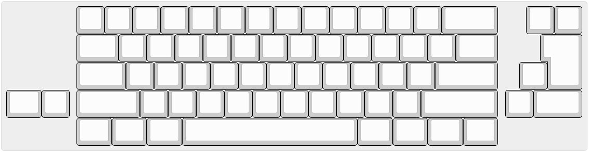

# スイッチのはんだづけ

## 注意
取り付け穴の精度によってはスイッチが斜めについてしまうかもしれません。（特に長いShiftなどMODキーで目立ちます）
一度スイッチをはめこんだあと確認して、斜めになるようであれば以下の対策をおすすめします。
- スイッチのプラスチック足部分を切り離す
- 基板の穴を広げる

USBケーブルを抜いてスイッチをはんだづけします。
ANSI,ISO,hhkb,スプリットBackSpaceなどレイアウトがいくつか選べます。   
レイアウトを確認してからはんだづけしてください。

スイッチが干渉しなければどのレイアウトを選んでもファームウェアを書き換えることで動作します。

## Alpha2 PCBの場合
hhkbレイアウトの代わりに`JIS "\ (ろ)キー"`を選択できます。



# スタビライザーの取り付け
必要な位置にスタビライザーを取り付けます。

# ボトムPCBとアクリルカバーの取り付け
以下のようにネジとナットで取り付けていきます。
カバーのつかない部分、カバーを取り付ける部分で使用するネジの方向、ナットの数が違います。
カバーのつかない部分はMain PCB側にネジとナットを取り付けて用意、カバーを取り付ける部分はBottom PCB側にネジを取り付けて両PCBを合わせて残りのナットを取り付けます。

## カバーのつかない部分
```
[ネジ ↓]
-----------------
Main PCB
-----------------
[ナット]
[ナット]
-----------------
Bottom PCB
-----------------
[ナット]
```

## カバーの部分
```
[ネジ↓]
-----------------
アクリルカバー
-----------------
[スペーサー]
-----------------
Main PCB
-----------------
[ナット]
[ナット]
-----------------
Bottom PCB
-----------------
[ネジ↑]
```

# 完成  !
キーキャップを取り付ければ完成です。   
お疲れ様でした。

