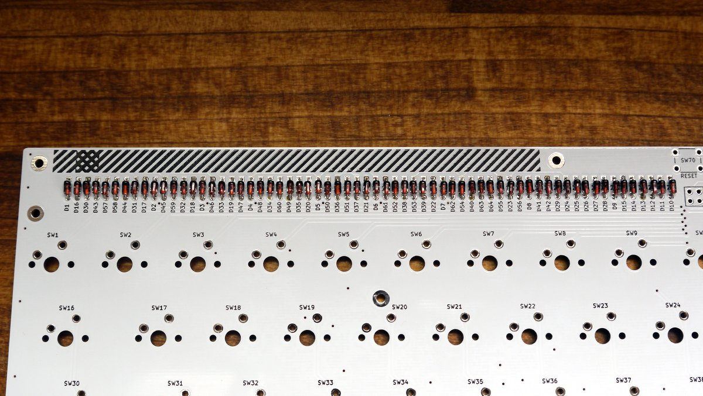
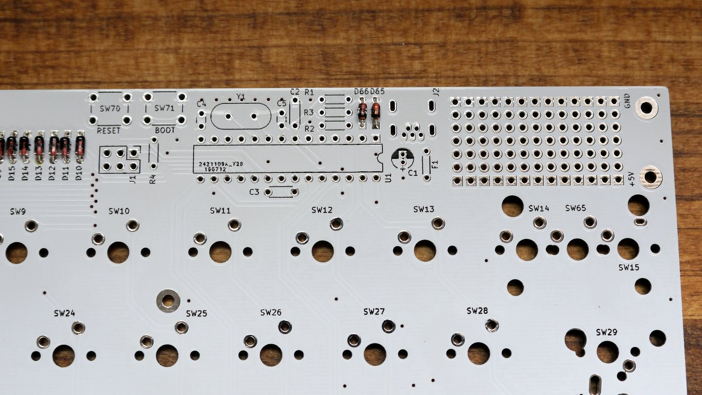
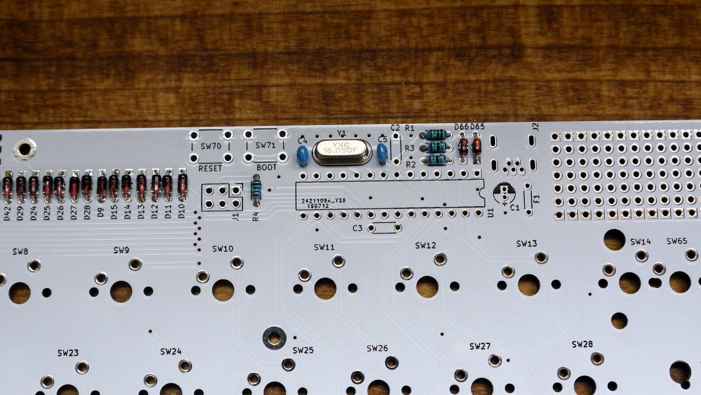
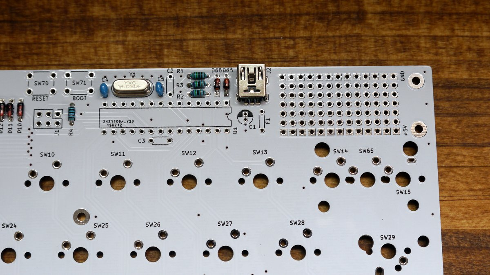
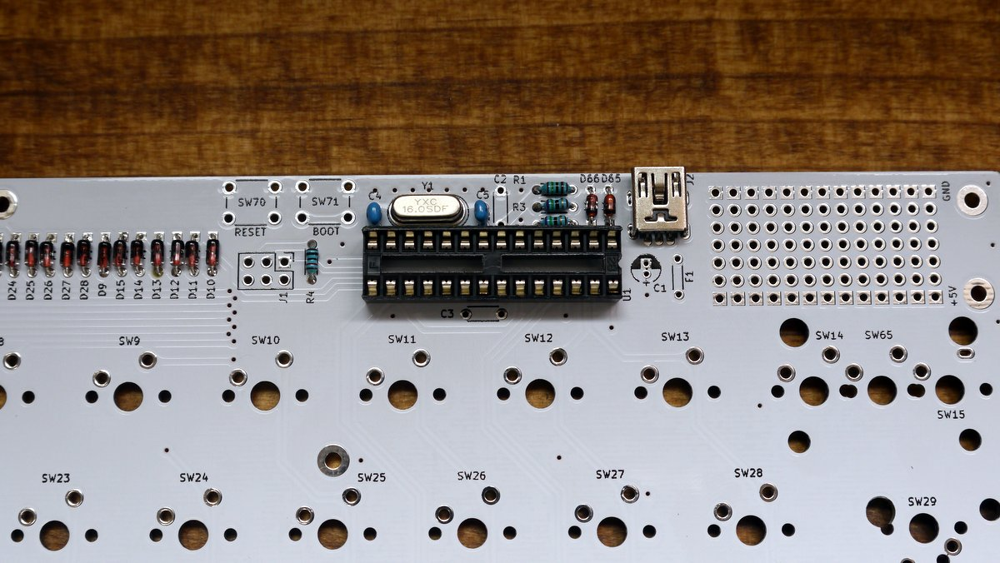
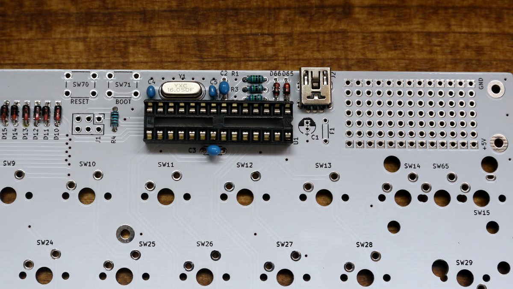
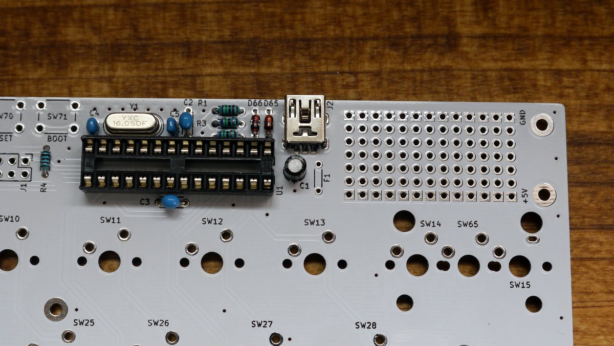
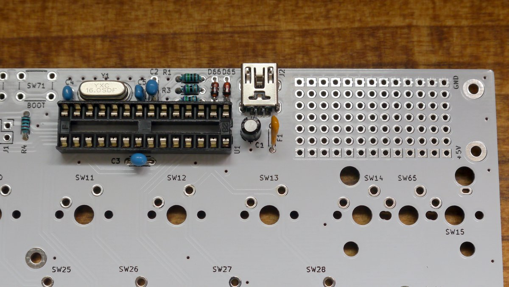
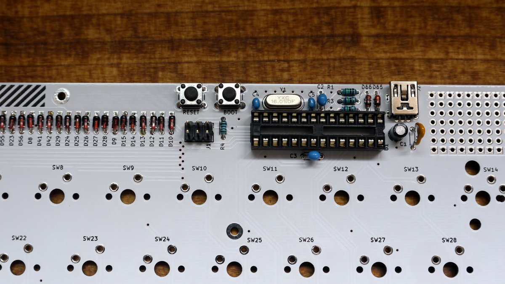
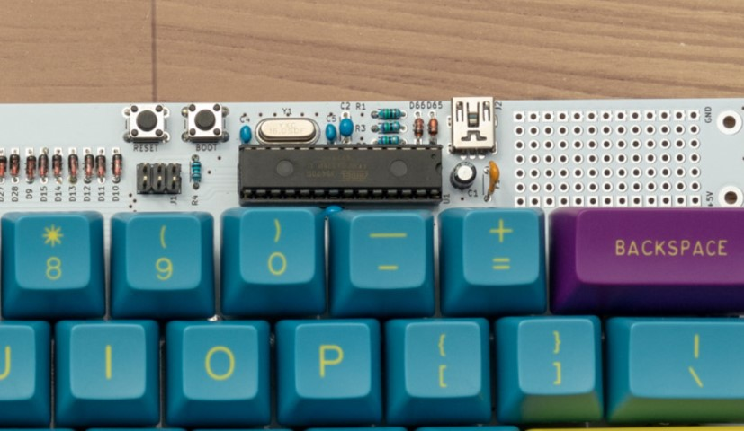

# はんだづけ

## 組立を始める前に
- 部品が揃っているか[BOM](./BOM.md)を見て確認する
- もしはんだづけに不慣れなら以下のサイトで勉強する
  - [Helixキーボードキットの制作に必要な工具メモ](https://gist.github.com/mtei/6957107a676ddfa85bde0ae41f8fa849)内の[リンク集 - はんだづけ編](https://gist.github.com/mtei/6957107a676ddfa85bde0ae41f8fa849#%E3%83%8F%E3%83%B3%E3%83%80%E4%BB%98%E3%81%91%E7%B7%A8)
  - https://learn.adafruit.com/adafruit-guide-excellent-soldering/tools

## はんだづけ
### ダイオード(1N4148)
D1-D64をはんだづけします。   
ダイオードは`極性`があります。向きに注意して下さい。   
ダイオードの黒い帯がある方がカソードです。(PCBの四角いパッド側)   

### ツェナーダイオード
D65,D66をはんだづけします。
ダイオードは`極性`があります。向きに注意して下さい。   
ダイオードの黒い帯がある方がカソードです。(PCBの四角いパッド側)   
はんだづけするパッドが小さい場合があるので穴の内部で導通するようにしっかりと温めてください。   

### 抵抗
抵抗をはんだづけします。

|Ref   |値  |カラーコード  |
|------|----|-------------|
|R1    |1.5k|茶/緑/黒/茶/茶|
|R2,R3 |75  |紫/緑/黒/金/茶|
|R4    |10k |茶/黒/黒/赤/茶|

### クリスタルと積層セラミックコンデンサ(22pF)
積層セラミックコンデンサは2種類あります。   
リードの間隔で判別できます。

| Ref  | 値    | リードの間隔 |
|------|-------|------------|
| C4,5 | 22pF  | 2.5mm      |

### USBコネクタ
ピンの間隔が狭いのでブリッジに注意して下さい。   
はんだづけしたあとによく確認すること。

### ICソケット
ICソケットは`向き`があります。   
ICソケットの端の切り欠けとPCB上のシルクをあわせます。

### 積層セラミックコンデンサ(0.1uF)
積層セラミックコンデンサは2種類あります。   
リードの間隔で判別できます。

| Ref  | 値    | リードの間隔 |
|------|-------|------------|
| C2,3 | 0.1uF | 5mm        |

### 電解コンデンサ(C1)
電解コンデンサは`極性`があります。向きに注意して下さい。   
短い足の方がカソードです。(PCBの四角いパッドの方)

### リセッタブルフューズ(F1)

### タクタイルスイッチとピンヘッダ

### ATMEGA328P
ATMEGA328PをICソケットに差し込みます。

ATMEGA328Pは`極性`があります。向きに注意して下さい。   
ICソケットの切り欠けとATMEGA328Pの切り欠けをあわせます。   
画像も参考にして下さい。

## USBケーブルを接続する前のチェックリスト
- VCC(5V)とGNDがショートしていないか、USBコネクタのピンがショートしていないか
- 極性のある部品の向き(ATMEGA328P、ダイオード、リセッタブルヒューズ、電解コンデンサ)
- 抵抗の値と場所

## NEXT
[USBケーブルを接続してブートローダをテストする](./bootloader.md)